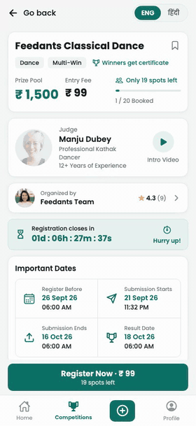
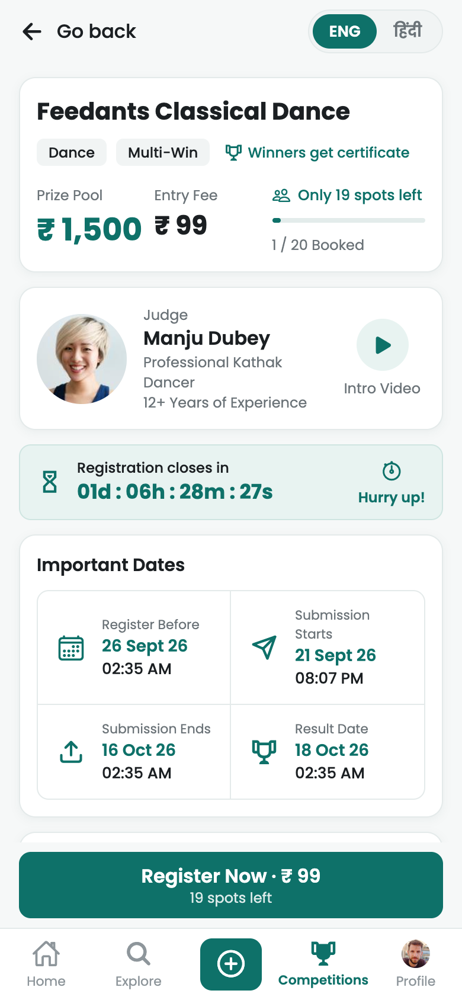
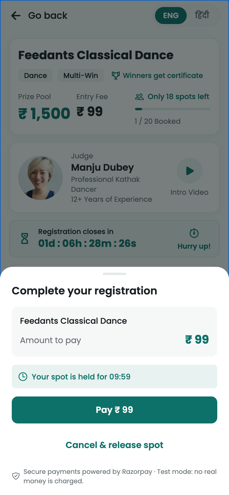
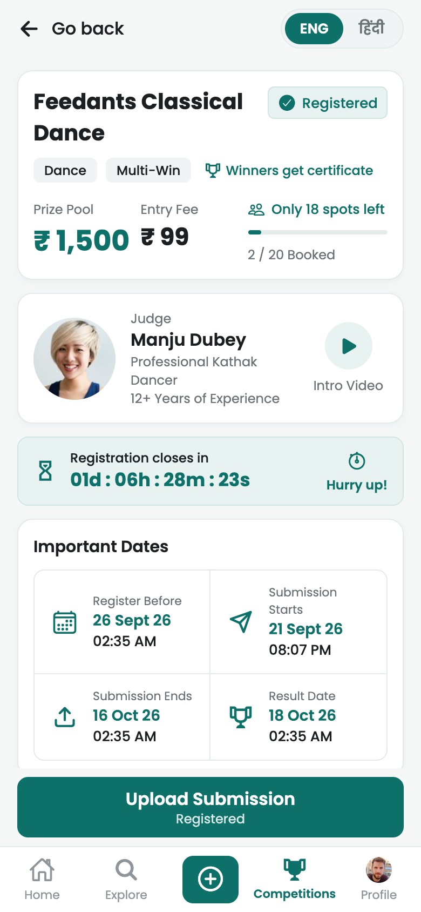
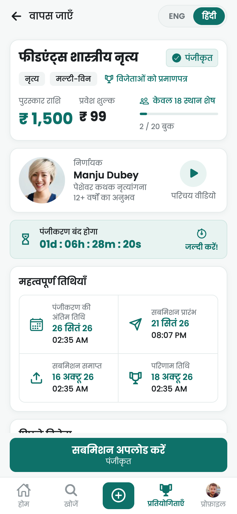
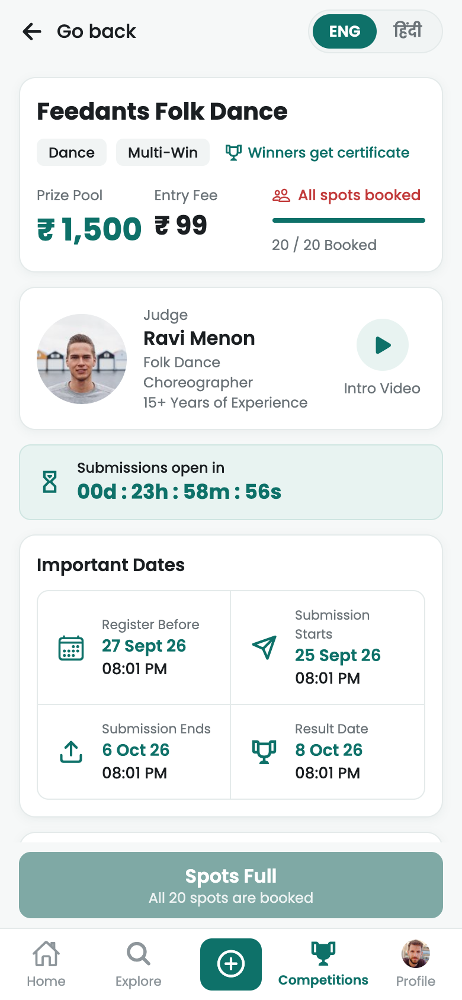
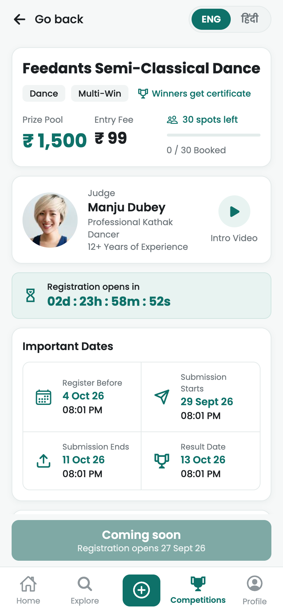
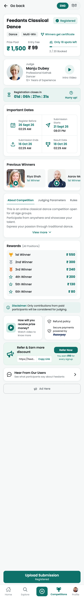

# Feedants: Competition Details

<p align="center">
  <a href="https://drive.google.com/file/d/1qSvXxC1tLQBG2Hgd7WFtL8oonP5Yx0r4/view?usp=sharing">
    
  </a>
  <br />
  <b>▶ <a href="https://drive.google.com/file/d/1qSvXxC1tLQBG2Hgd7WFtL8oonP5Yx0r4/view?usp=sharing">Watch the full demo video (4 min)</a></b>
</p>

A working, full-stack **Competition Details** screen for the Feedants mobile app. Every value on the screen comes from the API. Users can register, pay, upload a submission and switch between English and Hindi, and the booking flow stays consistent when many users register at once.

| Layer | Tech |
|---|---|
| Mobile app | **React Native** (Expo SDK 57, Expo Router, TypeScript, TanStack Query) |
| API | **Node.js + Express** 5 (TypeScript, Zod validation, JWT) |
| Database | **MongoDB** 8 as a replica set (Mongoose, multi-document transactions) |

- **Setup and run instructions, environment variables:** [SETUP.md](SETUP.md)
- **Data model, lifecycle, API, concurrency design:** [docs/BACKEND_DESIGN.md](docs/BACKEND_DESIGN.md)

| Guest | Checkout (spot held) | Registered (the design) | Hindi |
|---|---|---|---|
|  |  |  |  |

| Full | Upcoming | Whole screen |
|---|---|---|
|  |  |  |

<sub>Screenshots are from the web preview at phone width (390 pt); the app itself targets iOS and Android through Expo Go.</sub>

---

## Quick start

```bash
# 1. MongoDB as a replica set (see SETUP.md for Homebrew / Atlas options)
docker compose up -d

# 2. API
cd backend && cp .env.example .env && npm install && npm run seed && npm run dev

# 3. App: scan the QR code with Expo Go (phone on the same Wi-Fi)
cd frontend && cp .env.example .env && npm install && npx expo start
```

Sign up from the Home screen, or log in with the demo participant **9999999999** / organizer **8888888888**. Payments run in **mock mode** (no keys needed). `npm run seed` resets the database at any time.

---

## What works

Every element of the design is backed by the API:

| Design element | Behaviour |
|---|---|
| Title, tags, certificate, prize pool, entry fee | From the competition document; money is stored in paise |
| **Registered** badge | Shown only when the logged-in user has a confirmed registration |
| "Only 19 spots left", "1 / 20 Booked", progress bar | Live seat counters, polled every 15 s while the screen is visible |
| Judge card + **Intro Video** | Judge collection; plays in an in-app video player |
| "Registration closes in 01d : 06h : 28m : 32s", **Hurry up!** | Counts down to the *next* milestone using server-synchronised time; "Hurry up!" appears when fewer than 48 h or fewer than 25 % of spots remain; refetches when it reaches zero |
| Important Dates | Competition timeline, shown in the device's time zone |
| Previous Winners (with videos) | Results from earlier editions of the same competition series |
| About / Judging Parameters / Rules tabs, **View more** | Localized content from the API |
| Rewards 1st–6th | Validated on the server to add up exactly to the prize pool |
| Disclaimer, refund policy, prize-money video | From the competition |
| Refer & Earn: link, **Copy Link**, **Refer Now** | Per-user referral code; clipboard; native share sheet |
| Hear From Our Users | Testimonials in a bottom sheet |
| **ENG / हिंदी** | UI labels translated in the app; content translated by the API, with English fallback |
| Bottom button | Every state driven by the server: Register · ₹99 / Log in / Complete Payment (hold timer) / Upload Submission / Update Submission / Submissions open in… / Submissions Closed / Spots Full / Registration Closed / Coming soon / Cancelled / Results |
| Home | Guests: landing page with **Sign up** / **Log in**, how it works, live platform numbers, category shortcuts. Logged in: greeting, personal stats and quick actions. No competition list (that lives in Competitions). |
| Bottom tab bar | Home · Competitions (browse) · **+** (organizer dashboard) · Profile. The design's separate Explore tab was merged into Competitions, since both would browse the same list. |

### Beyond the design screen

| Feature | What it does |
|---|---|
| **Browse with filters** | Search, stage chips (**Active** by default, then Ongoing / Closing soon / Upcoming / Past / All / **Saved**), and a filter sheet (category, free/paid, spots left, sort). Filtering and pagination happen on the server. Leaving the Competitions tab resets it, so coming back always shows the list. |
| **Saved competitions** | Bookmark icon on every competition (filled when saved, also shown on list cards). The **Saved** chip lists only your bookmarks; guests are sent to log in. Save/unsave are idempotent. |
| **Stale competitions** | Every competition has a computed stage (`upcoming` / `ongoing` / `past`) from server time, so a finished or cancelled competition can never appear as active. |
| **Organizer dashboard** (+ tab) | Your competitions (drafts included) grouped Drafts / Upcoming / Ongoing / Past, with bookings and submissions. Publish, edit, cancel (paid participants marked for refund), delete drafts. |
| **Create / edit form** | 6 steps covering every field on the screen, in English and Hindi: basics, schedule (native date pickers), spots & prizes (the prize pool is derived from the rewards), judge (photo upload), details, review. Checked on the device, then again by the server, with errors mapped back to the right step. |
| **Ratings** | Once a competition ends (results announced), participants rate the **competition** and the **organizer** (1–5 stars + comment), and rate fellow participants' **sportsmanship**. |
| **Public profiles** | For every user: registered / submitted / **no-shows** / won, sportsmanship rating, competitions joined. For organizers: organizer rating and all their competitions by stage. |
| **My profile** | Photo upload, name / city / bio, stats, "My competitions" with registration status, language saved to the profile. |
| **Default data** | On first start against an empty database, loads a mix of past, ongoing, upcoming and cancelled competitions with every date computed from that moment. |

### How registration works

1. **Register:** the API holds a spot for 10 minutes and creates a payment order. Holding the spot and creating the registration happen in one MongoDB transaction.
2. **Pay:** the checkout sheet shows the remaining hold time. In mock mode, the API signs the payment exactly as Razorpay does (HMAC-SHA256 of `orderId|paymentId`). The app sends that to `/verify`, where the server checks the signature and confirms the registration.
3. **Upload:** only confirmed (paid) participants can upload, and only inside the submission window. The upload shows progress, and the entry can be replaced until submissions close.

Abandoned holds are released by a background job. If a payment arrives *after* its hold expired, the user keeps a spot if one is still free; otherwise the registration is marked `refund_required`.

---

## Tests

```bash
cd backend && npm test      # 76 tests, runs its own in-memory MongoDB replica set
cd frontend && npm test     # 17 tests
```

Backend highlights:
- **50 users race for 20 spots:** exactly 20 succeed, 30 get `409 COMPETITION_FULL`, and the counters stay consistent. I confirmed the test fails when the capacity check is removed.
- **One user sends 10 parallel requests:** they get one registration, one payment order and one held spot.
- **The app's payment verify and two webhook deliveries race:** the seat is confirmed exactly once.
- **Three hold-expiry jobs run at once:** each hold is released exactly once.
- **Late payment:** confirmed if a spot is free, otherwise `refund_required`.
- **Lifecycle boundaries:** every phase edge is tested with a fake clock, including the design's overlapping registration and submission windows.
- **Submission rules:** paid participants only, inside the window, allowed file types only.
- **Organizing:** validation of every field, drafts private until published, only the owner can edit, spots can't go below bookings, the fee locks after the first registration, cancelling marks paid participants for refund.
- **Browse:** every stage filter (Active never contains finished or cancelled competitions), category / fee / spots / search / sort / pagination.
- **Ratings:** concurrent and edited ratings keep the totals exact; only participants can rate, and only after the competition ends; no rating yourself.
- **Profiles:** no-shows, public profile never exposes the phone number, drafts are not public.
- **Default data:** loads exactly once even when several servers start together, and never on a non-empty database.

Frontend: the bottom-button logic for every state, the organizer form model (rupees ↔ paise, per-step checks, server-error mapping), and the money, countdown and ordinal formatters.

---

## Important assumptions

- **"Multi-Win"** means several winning positions (1st–6th), not that one person can win more than once.
- **Previous Winners** come from past *editions* of the same competition series. That is why the design shows two "1st Winner" entries.
- **Registration and submission windows can overlap.** The design has submissions starting 6 Aug and registration closing 10 Aug, so registered users can upload before registration closes.
- **Spots left** counts both paid registrations and temporary payment holds. **Booked** counts only paid registrations.
- **Entry is paid**, and only paid participants are judged (the design's disclaimer). A free competition (`entryFee: 0`) confirms immediately.
- **Authentication is out of scope.** A demo phone login issues real JWTs, so every user-specific state is genuine; OTP would replace it in production.
- **Refunds** are recorded as a status (`refund_required`); actually processing refunds is future work.
- **Anyone can organize:** a logged-in user becomes the organizer of the competitions they create. A real product would add verified organizer accounts or an approval step.
- **Ratings** open once a competition ends (results announced), not when submissions close, so participants rate the whole experience including judging, and only for confirmed (paid) participants: one rating per person per competition, editable. Sportsmanship ratings are between participants of the same competition.
- **No-show** = confirmed participant who never submitted before the submission window closed.
- **Ads** are a static placeholder.
- **Times** are stored in UTC and shown in the device's time zone (IST in the design).

## Major technical decisions

- **The server owns every rule.** It computes the phase, the user's state and the allowed actions (with reason codes) in pure functions. The app only maps them to labels, so business logic never lives in two places. The same functions re-check every write.
- **Overselling is prevented by one atomic, conditional update:** `$inc seats.held` only if `confirmed + held < total` and registration is open. MongoDB applies single-document updates atomically, so no locks or queues are needed.
- **The hold and the registration are created in one transaction,** backed by a unique `(competitionId, userId)` index. Double taps, retries and a second device can't create a second registration or leak a seat. The contended competition document is written last, to keep the conflict window short.
- **Idempotency everywhere.** Registering again returns the existing hold. Payment confirmation only changes `pending_payment → confirmed` once, and `orderId` is unique, so the app's verify call and the webhook can arrive in any order.
- **Denormalised seat counters** on the competition document keep reads cheap and let one update enforce capacity. Counting registrations on every page view would be slow.
- **Server time for countdowns.** Each response carries `serverTime`; the app keeps an offset, so a wrong device clock can't show wrong countdowns. When a countdown reaches zero, the app asks the server for the new state rather than guessing.
- **Split read endpoints.** A full details payload (per user, per language) plus a tiny `/availability` endpoint for polling spot counts.
- **Payment provider behind an interface.** The mock and Razorpay providers share the same order and signature flow; `PAYMENT_PROVIDER=razorpay` switches over.
- **Upload URLs are built from the request host,** so a phone on the LAN gets links it can open, and moving files to a CDN later won't need a data migration.
- **App architecture:** Expo Router with file-based routes; a feature folder per screen; React Query for server state (per-language cache, focus-aware polling, refetch when the app returns to the foreground). Only Expo Go-compatible modules are used, so no native build is needed.

## Trade-offs

| Choice | Benefit | Cost |
|---|---|---|
| Transactions for booking | Simple and obviously correct | Needs a replica set; under very heavy contention, write conflicts cause retries. A one-document conditional update with a compensating write would scale further at the cost of more complex failure handling |
| Polling availability every 15 s | Stateless, works through any proxy | Counts can be up to 15 s stale (writes are always checked on the server) |
| Spot hold during payment | Users don't pay for a spot they then lose | Abandoned checkouts block a spot for up to 10 min + sweep interval |
| Sweeper job instead of a TTL index | Can decrement counters in the same transaction | Runs on every API instance (safe, but redundant work) |
| Local disk for uploads | No cloud account needed to run it | Large files pass through the API; not suitable for several instances |
| Content resolved per language on the server | Smaller payloads, one source of truth | Switching language needs a refetch (cached after the first time) |
| Mock payment in development | Anyone can run the full flow | Real Razorpay checkout needs a development build (`react-native-razorpay` is a native module) |

## What I'd improve for production

- **Real authentication:** OTP login, refresh tokens, verified organizer accounts, and moderation of reviews and ratings (reporting, abuse detection).
- **Razorpay checkout** in a development build, plus webhook-driven reconciliation and automatic refunds for `refund_required`.
- **Uploads:** direct-to-S3/GCS with presigned URLs, video transcoding and thumbnails, and malware and duration checks.
- **Real-time spots:** Server-Sent Events or WebSockets fed by MongoDB change streams instead of polling.
- **Shared infrastructure:** Redis for caching competition content and for a shared rate-limit store; the hold sweeper as a single scheduled worker (or a leader lock) rather than on every instance.
- **Very large competitions:** sharded seat counters, and a waitlist when full.
- **Observability:** structured logs (pino) with request IDs, metrics (holds, conversions, conflicts), tracing and alerts.
- **Delivery:** CI running lint, typecheck and tests for both apps; EAS builds; OpenAPI docs generated from the Zod schemas; database migrations instead of `syncIndexes`.
- **More tests:** component tests for the screen (React Native Testing Library) and an end-to-end flow (Maestro/Detox).
- **Accessibility and polish:** skeleton loaders, dynamic type testing, RTL-safe layouts, and translations reviewed by native speakers.

---

## Project structure

```
backend/
  src/modules/competitions   lifecycle.ts (pure rules) · service · serializer · routes
  src/modules/registrations  hold → pay → confirm, cancel, expiry (transactions)
  src/modules/payments       provider interface (mock / Razorpay), webhook
  src/modules/submissions    upload storage + window/paid-only rules
  src/models                 Mongoose schemas with indexes and validation
  tests/                     vitest + supertest against an in-memory replica set
frontend/
  src/app                    Expo Router screens (tabs, competition list/details, login)
  src/features/competition   screen, section components, hooks, CTA mapping
  src/api                    fetch client, endpoints, types, React Query, upload
docs/BACKEND_DESIGN.md       design document
```
